# Part 3: Exploratory Data Analysis Report

## Analysis of 'dataset_info_id'

### Central Tendency
|        |   dataset_info_id |
|:-------|------------------:|
| mean   |                 5 |
| median |                 5 |
| count  |            339286 |

### Variability
|     |   dataset_info_id |
|:----|------------------:|
| std |                 0 |
| min |                 5 |
| max |                 5 |

### Histogram
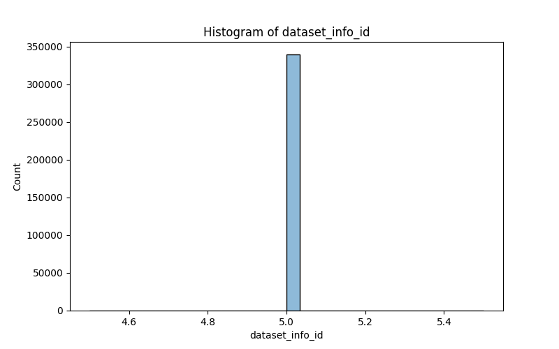

### Boxplot

### QQ-Plot
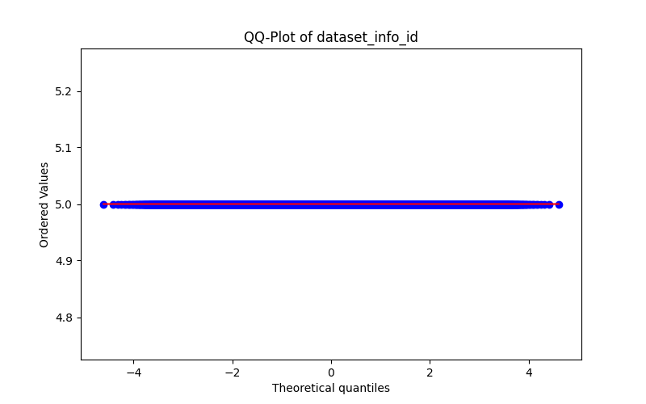

## Analysis of 'score_sentiment'

### Central Tendency
|        |   score_sentiment |
|:-------|------------------:|
| mean   |         0.0220248 |
| median |         0         |
| count  |    339239         |

### Variability
|     |   score_sentiment |
|:----|------------------:|
| std |          0.529724 |
| min |         -1        |
| max |          0.9992   |

### Histogram

### Boxplot
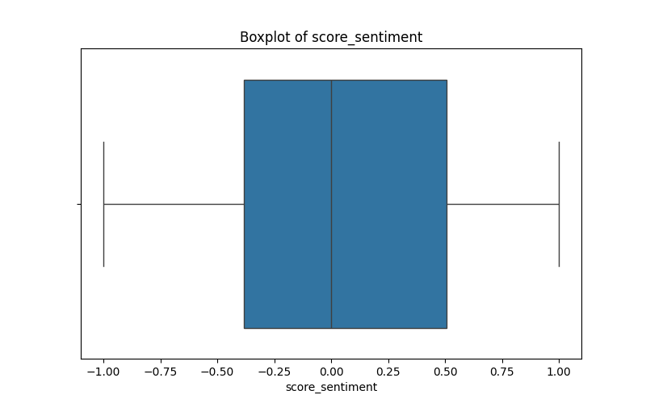

### QQ-Plot

## Analysis of 'score_misinformation'

### Central Tendency
|        |   score_misinformation |
|:-------|-----------------------:|
| mean   |               0.312263 |
| median |               0.197592 |
| count  |          167224        |

### Variability
|     |   score_misinformation |
|:----|-----------------------:|
| std |            0.293703    |
| min |            3.27315e-06 |
| max |            1           |

### Histogram
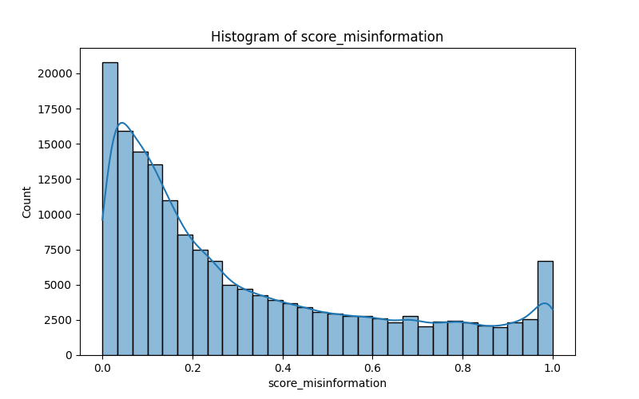

### Boxplot

### QQ-Plot

## Analysis of 'id_message'

### Central Tendency
|        |   id_message |
|:-------|-------------:|
| mean   |     421909   |
| median |      84909.5 |
| count  |     339286   |

### Variability
|     |       id_message |
|:----|-----------------:|
| std | 484366           |
| min |      2           |
| max |      1.51644e+06 |

### Histogram
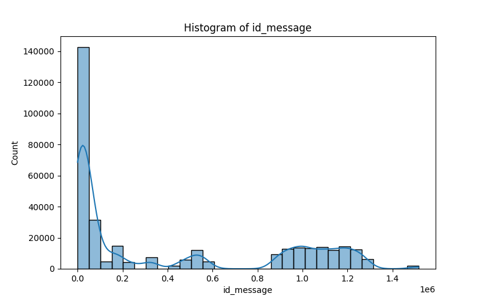

### Boxplot
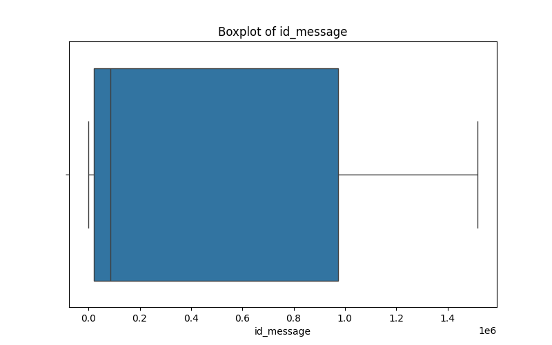

### QQ-Plot

## Analysis of 'caracteres'

### Central Tendency
|        |   caracteres |
|:-------|-------------:|
| mean   |      270.866 |
| median |      137     |
| count  |   339286     |

### Variability
|     |   caracteres |
|:----|-------------:|
| std |      451.632 |
| min |       12     |
| max |     4096     |

### Histogram
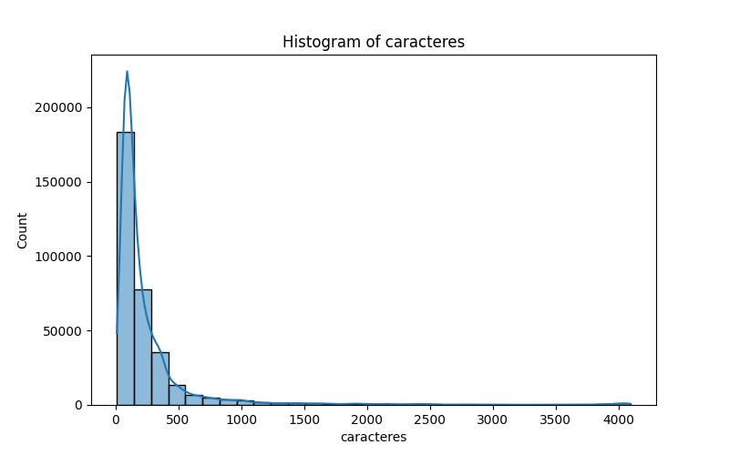

### Boxplot

### QQ-Plot

## Analysis of 'words'

### Central Tendency
|        |       words |
|:-------|------------:|
| mean   |     42.0278 |
| median |     20      |
| count  | 339286      |

### Variability
|     |     words |
|:----|----------:|
| std |   74.0505 |
| min |    5      |
| max | 1261      |

### Histogram
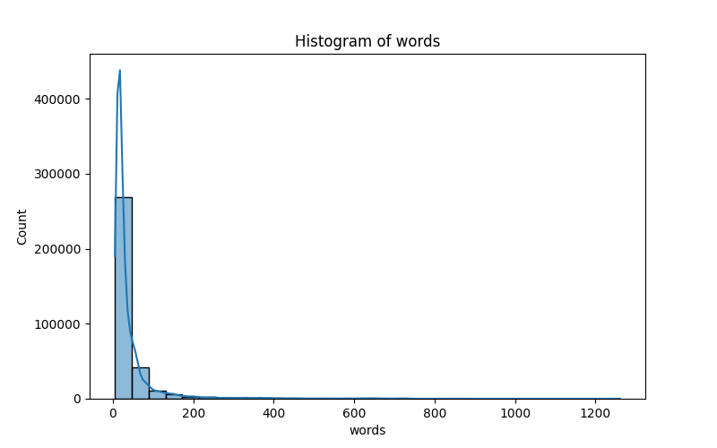

### Boxplot

### QQ-Plot

## Analysis of 'sharings'

### Central Tendency
|        |   sharings |
|:-------|-----------:|
| mean   |    906.599 |
| median |      1     |
| count  | 339286     |

### Variability
|     |   sharings |
|:----|-----------:|
| std |    3843.06 |
| min |       1    |
| max |   17422    |

### Histogram
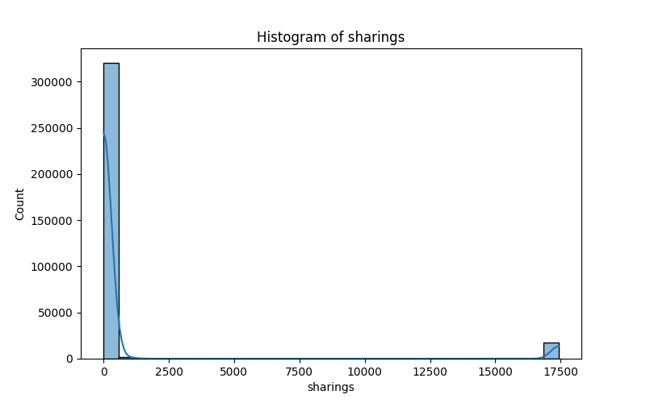

### Boxplot
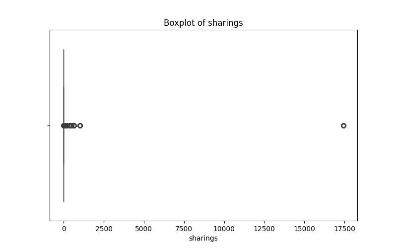

### QQ-Plot
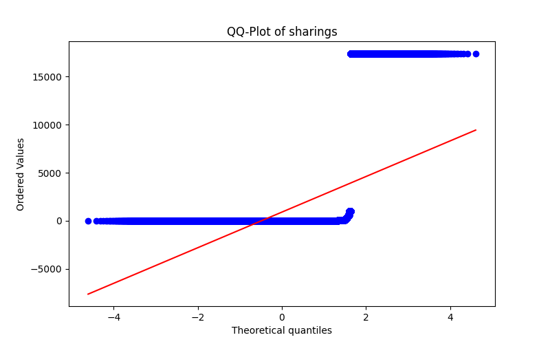

## Analysis of 'viral'

### Central Tendency
|        |        viral |
|:-------|-------------:|
| mean   |      0.44278 |
| median |      0       |
| count  | 339286       |

### Variability
|     |    viral |
|:----|---------:|
| std | 0.496716 |
| min | 0        |
| max | 1        |

### Histogram
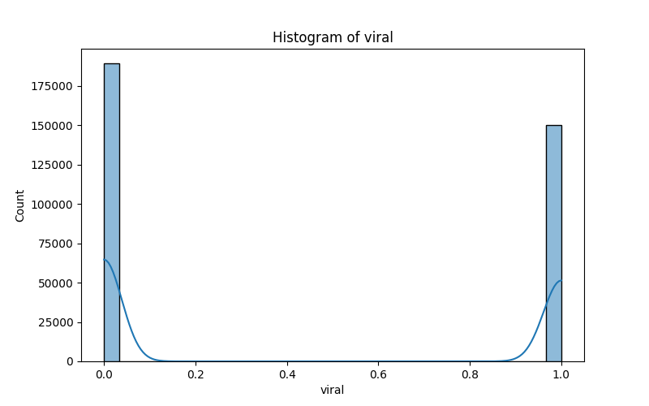

### Boxplot

### QQ-Plot
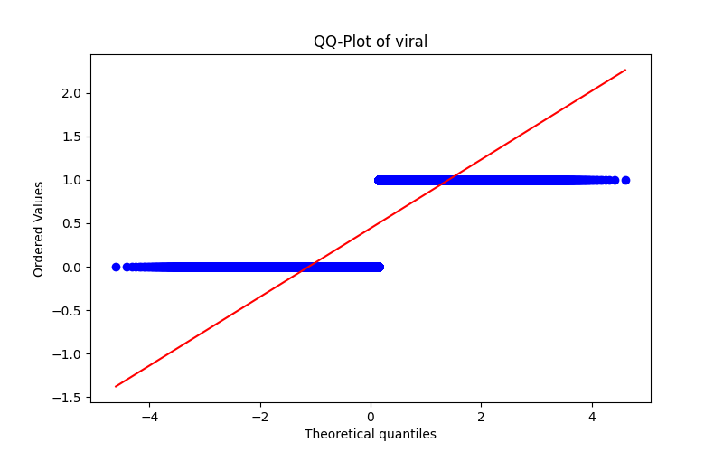

## Analysis of 'sentiment'

### Central Tendency
|        |     sentiment |
|:-------|--------------:|
| mean   |      0.150563 |
| median |      0        |
| count  | 339286        |

### Variability
|     |   sentiment |
|:----|------------:|
| std |    0.427183 |
| min |   -1        |
| max |    1        |

### Histogram

### Boxplot

### QQ-Plot
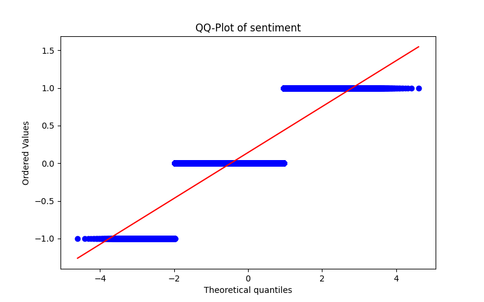

